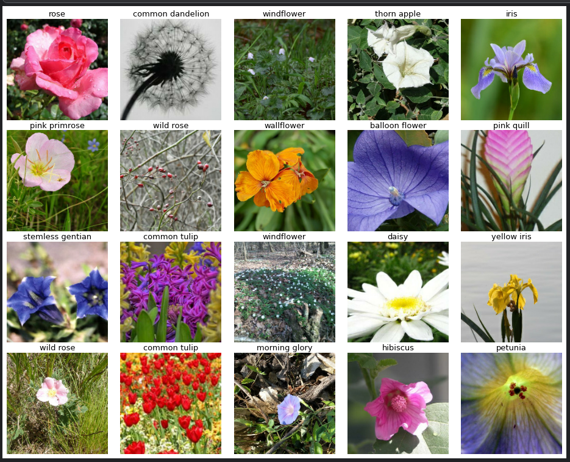
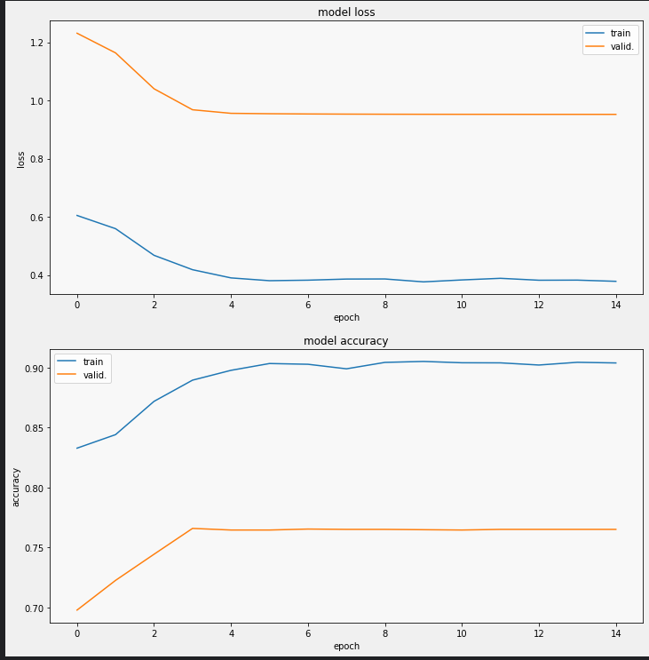
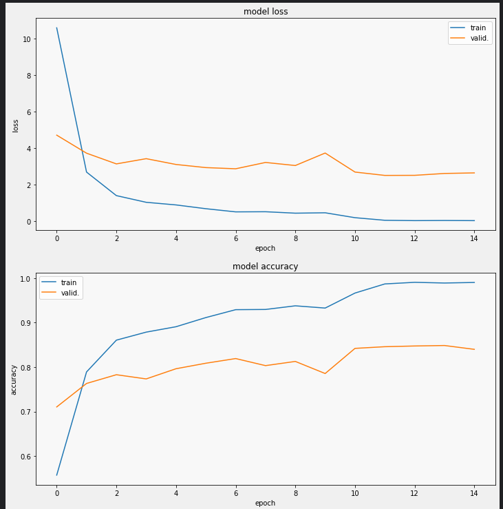
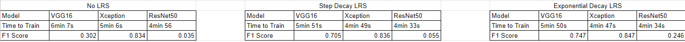
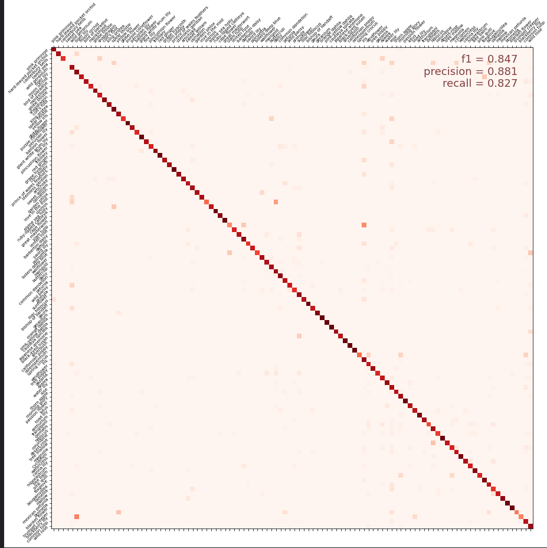

# Petals to the Metal Kaggle Challenge

This repository holds an attempt to use TPU's to speed up the training of deep learning models on images of flowers and classifying them as the correct type from the "Petals to the Metal" Kaggle challenge (https://www.kaggle.com/competitions/tpu-getting-started/overview)

## Overview

The task, as defined by the Kaggle challenge is “to build a machine learning model that identifies the type of flowers in a dataset of images (for simplicity, we’re sticking to just over 100 types).” The approach in this repository formulates the problem as a classification task, using different models which are pre-trained on imagenet. We are also using TPUs  in order to speed up the process of fitting our models. We will also be observing the time it takes to fit our models to our training dataset as well as observing the effects of a Learning Rate Scheduler.

Note: While the notebook is in here you wont be able to see any of the cells run since most of it is required to be on a Kaggle notebook so here is the link to my kaggle notebook to see the full code and all the cells run: (https://www.kaggle.com/code/ryanlbui/final-exam-2)

  * **Summary of the performance achieved**:  My best model was able to get a F1 score of 0.76318 while at the time of writing the best entry has an F1 score of 0.98242
## Summary of Workdone

### Data

* Data:
  * Type:
    *  Input: images of flowers ranging from (192x192 pixel jpegs) to (512x512 pixel jpegs) each stored in TFRecord format
  * Size: The size of the data is 5.15GB
  * Instances (Train, Test, Validation Split): 2753 training images, 7382 for testing, 3712 for validation
  * Note: The data is not here is this repo because it would've taken to long to upload it. When you are using the kaggle notebooks you dont actually need to download the dataset onto your computer anyway.

#### Data Visualization

### Problem Formulation

* Define:
  * Input / Output: Our inputs were the images of the flowers and our output is going to be the labeled image of the flowers. 
  * Models
    * I used 3 different models pre-trained on imagenet and those models were VGG16, Xception, and ResNet.  Two of these models were suggested by the people who made the competition(VGG16 and Xception) and the other one is ResNet which I chose due to its popularity. 
    * I also compared the performance of the models with 2 different Learning Rate Schedulers as well as without one at all in order to see if it had any impact of the performance. One of these LRS's is an exponentional decay one provided by the people who made the competition and another one is a step decay LRS which I found from a separate kaggle challenge that also dealt with image classification. 
  * For our optimizer we used adam and for our loss we used sparse categorical crossentropy since we were dealing with many different types of flowers that we had to classify. 

  

### Training

* Describe the training:
  * How you trained: I used keras and tensorflow running on the computers provided by Kaggle as well as using Kaggle's TPUs
  * How long did the training take?: Training took anywhere from 1min 2s to 1min 21s and the different models didn't really differ too in terms of how long it took to train however what did change the time it took to train was adding in a Learning Rate Scheduler. 
  * Here are some of the Training Curves you can see the rest in the notebook:
  * The first pair is the VGG16 model using an expoential decay LRS and the second pair is Xception using a step decay LRS.
  
  
  
  
  
  * How did you decide to stop training: I had 12 epochs and I let it train for all of the 12 epochs. 

### Performance Comparison

* From the Kaggle challenge we are evaluated based off of the F1 score which is calculated using precision and recall. 
* Show/compare results in one table:
  
  
* To visualize our results we used a confusion matrix:
  
* Note: This is only of the matrices you can find the rest of them inside of the notebook
* The above confusion matrix is from using Xception with an exponential decay LRS.

### Conclusions

* It seems that Xception had the better F1 scores regardless of the different LRSs we used; however we did see that using a step decay LRS significantly improved the training F1 score for the VGG16 model. We also can conclude that while using TPUs the time to train the 3 different models was different with VGG16 being the slowest of the 3 while pretty accurate and ResNet being the fastest however not very accurate for this dataset. We also saw that implementing a LRS did help with the training time for all models. 

### Future Work

* I would like to try start learning how to work with time series and understanding how to build models using it. 
* Using what I know now I can now use Kaggle’s TPUs for any image classification problem. I also have learned that different LRSs can impact a model’s performance so I will have to be sure to use the correct one when using a deep learning model. 

## How to reproduce results

In order to reproduce these results you will need to use Kaggle’s own notebooks since this is the only way to get access to their TPUs. and you will need to use the 3 models that I mentioned earlier(VGG16, ResNet, Xception) and make sure they are pre-trained on imagenet. Be sure to only use 20 epochs for the neural network. Most of the code used is provided by the Kaggle challenge itself and you can use this to use the TPU in a correct way. You can also look up the keras documentation to use the different models if you don’t already know it. Another thing to note is the use of the %%time command in order to find out how long it took each model to train.

### Overview of files in repository

* Describe the directory structure, if any:
  * There are 4 different sizes of images and each is going to have their respective test set, training set and validation set.
  * submission.csv is the file that was submitted to the Kaggle competition. 

### Software Setup
Be sure to run all of this on a Kaggle notebook on their website that way you can actually access their TPUs and be able to send the dataset to that TPU.

### Data

* https://www.kaggle.com/competitions/tpu-getting-started/data

### Training

* All of our models take advantage of transfer learning which we use to pre-train our models on imagenet. We only have 10 epochs which can be increased however, to save on time I reduced the amount of epochs but it is worth mentioning that accuracy can be increased by increasing the amount of epochs. 
#### Performance Evaluation

* Describe how to run the performance evaluation: In this challenge we simply used the F1 score, precision and recall functions provided by sklearn.metrics. We also put our results into a confusion matrix to get a better visualization of our results. 

## Citations

* https://www.kaggle.com/code/ryanholbrook/create-your-first-submission#Introduction (Most of the code needed to do this study is going to be provided in this notebook)
* https://www.kaggle.com/code/aninditapani/xception-learning-scheduler-more-trainable-layers/notebook (for the step decay LRS)

